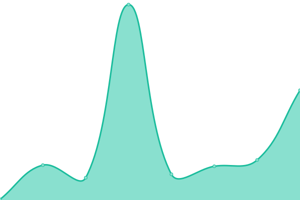
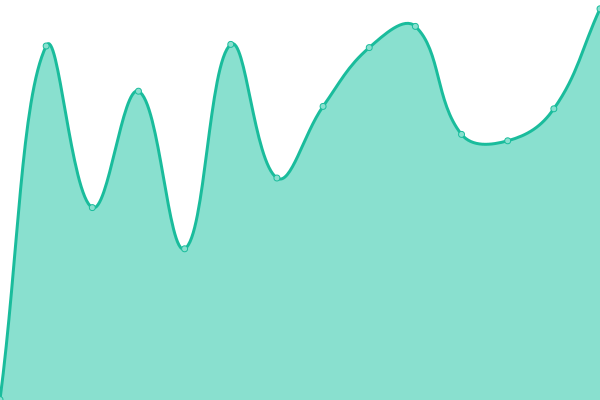

# [📈 Live Status](https://SpookyKipper.github.io/SpookhostStatusPage): <!--live status--> **🟧 Partial outage**

This repository contains the open-source uptime monitor and status page for [Spooky Kipper](https://SpookyKipper.github.io/SpookhostStatusPage), powered by [Upptime](https://github.com/upptime/upptime).

With [Upptime](https://upptime.js.org), you can get your own unlimited and free uptime monitor and status page, powered entirely by a GitHub repository. We use [Issues](https://github.com/SpookyKipper/SpookhostStatusPage/issues) as incident reports, [Actions](https://github.com/SpookyKipper/SpookhostStatusPage/actions) as uptime monitors, and [Pages](https://SpookyKipper.github.io/SpookhostStatusPage) for the status page.

<!--start: status pages-->
<!-- This summary is generated by Upptime (https://github.com/upptime/upptime) -->
<!-- Do not edit this manually, your changes will be overwritten -->
<!-- prettier-ignore -->
| URL | Status | History | Response Time | Uptime |
| --- | ------ | ------- | ------------- | ------ |
|  [Client Area](https://app.spookhost.eu.org) | 🟥 Down | [client-area.yml](https://github.com/SpookyKipper/SpookhostStatusPage/commits/HEAD/history/client-area.yml) | 

 378ms
     
 | 

<a href="https://SpookyKipper.github.io/SpookhostStatusPage/history/client-area">0.00%</a>
    

|  [cPanel](https://cpanel.spookhost.eu.org) | 🟥 Down | [c-panel.yml](https://github.com/SpookyKipper/SpookhostStatusPage/commits/HEAD/history/c-panel.yml) | 

 243ms
     
 | 

<a href="https://SpookyKipper.github.io/SpookhostStatusPage/history/c-panel">0.00%</a>
    

|  [FTP Server](ftpupload.net) | 🟩 Up | [ftp-server.yml](https://github.com/SpookyKipper/SpookhostStatusPage/commits/HEAD/history/ftp-server.yml) | 

 208ms
     
 | 

<a href="https://SpookyKipper.github.io/SpookhostStatusPage/history/ftp-server">99.68%</a>
    

|  [Nameserver 1](ns1.spookhost.eu.org) | 🟩 Up | [nameserver-1.yml](https://github.com/SpookyKipper/SpookhostStatusPage/commits/HEAD/history/nameserver-1.yml) | 

 103ms
     
 | 

<a href="https://SpookyKipper.github.io/SpookhostStatusPage/history/nameserver-1">100.00%</a>
    

|  [Nameserver 2](ns2.spookhost.eu.org) | 🟩 Up | [nameserver-2.yml](https://github.com/SpookyKipper/SpookhostStatusPage/commits/HEAD/history/nameserver-2.yml) | 

 102ms
     
 | 

<a href="https://SpookyKipper.github.io/SpookhostStatusPage/history/nameserver-2">100.00%</a>
    

|  [Online File Manager](https://files.spookhost.eu.org/new) | 🟥 Down | [online-file-manager.yml](https://github.com/SpookyKipper/SpookhostStatusPage/commits/HEAD/history/online-file-manager.yml) | 

 138ms
     
 | 

<a href="https://SpookyKipper.github.io/SpookhostStatusPage/history/online-file-manager">0.00%</a>
    

|  [phpMyAdmin](185.27.134.10) | 🟩 Up | [php-my-admin.yml](https://github.com/SpookyKipper/SpookhostStatusPage/commits/HEAD/history/php-my-admin.yml) | 

 119ms
     
 | 

<a href="https://SpookyKipper.github.io/SpookhostStatusPage/history/php-my-admin">100.00%</a>
    

|  [Softaculous](sv1.scriptinstall.rocks) | 🟩 Up | [softaculous.yml](https://github.com/SpookyKipper/SpookhostStatusPage/commits/HEAD/history/softaculous.yml) | 

 488ms
     
 | 

<a href="https://SpookyKipper.github.io/SpookhostStatusPage/history/softaculous">98.99%</a>
    

|  [Homepage](https://spookhost.eu.org/) | 🟥 Down | [homepage.yml](https://github.com/SpookyKipper/SpookhostStatusPage/commits/HEAD/history/homepage.yml) | 

 160ms
     
 | 

<a href="https://SpookyKipper.github.io/SpookhostStatusPage/history/homepage">0.00%</a>
    

|  [Forum](https://forum.spookhost.eu.org/) | 🟥 Down | [forum.yml](https://github.com/SpookyKipper/SpookhostStatusPage/commits/HEAD/history/forum.yml) | 

 897ms
     
 | 

<a href="https://SpookyKipper.github.io/SpookhostStatusPage/history/forum">100.00%</a>
    

|  [Accounts Management API - Essential](https://panel.myownfreehost.net/xml-api/) | 🟩 Up | [accounts-management-api-essential.yml](https://github.com/SpookyKipper/SpookhostStatusPage/commits/HEAD/history/accounts-management-api-essential.yml) | 

 837ms
     
 | 

<a href="https://SpookyKipper.github.io/SpookhostStatusPage/history/accounts-management-api-essential">100.00%</a>
    

|  [SSL API](https://my.gogetssl.com/api/) | 🟩 Up | [ssl-api.yml](https://github.com/SpookyKipper/SpookhostStatusPage/commits/HEAD/history/ssl-api.yml) | 

 559ms
     
 | 

<a href="https://SpookyKipper.github.io/SpookhostStatusPage/history/ssl-api">100.00%</a>
    

<!--end: status pages-->

[**Visit our status website →**](https://SpookyKipper.github.io/SpookhostStatusPage)

## 📄 License

- Powered by: [Upptime](https://github.com/upptime/upptime)
- Code: [MIT](./LICENSE) © [Spooky Kipper](https://SpookyKipper.github.io/SpookhostStatusPage)
- Data in the `./history` directory: [Open Database License](https://opendatacommons.org/licenses/odbl/1-0/)
